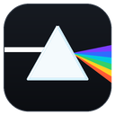
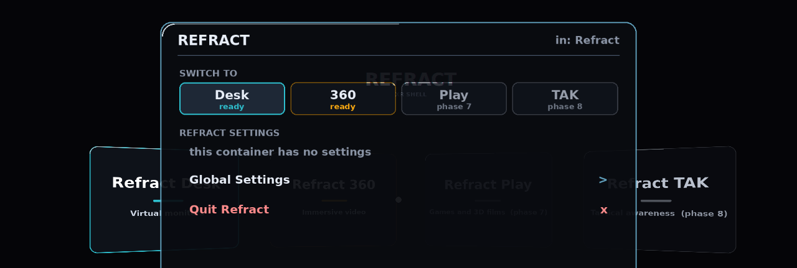

<h1 align="center">
  <br>
  Refract
</h1>
<p align="center"><em>A Linux desktop shell for VITURE XR glasses.</em></p>

<p align="center">
  
</p>

---

> ### ⚠️ This is an experiment, not a product
>
> Refract is a hobby project: partly to see how far an AI coding assistant
> could carry a real piece of hardware software end to end, partly to
> explore what a pair of 3DoF VITURE glasses is actually good for on Linux
> once you drive them directly instead of through someone else's app — what
> they're useful for, and what kind of interface works when your hands are
> on a laptop and your head is the pointer. It works, on the one laptop it
> was built and tested on, and it will have rough edges elsewhere. Features
> marked *experimental* below are still being figured out.
>
> It creates and destroys virtual monitors, rearranges your desktop layout,
> and switches the glasses between 2D and side-by-side — so treat it as a
> workbench, not an appliance. Nothing it does survives a logout.
>
> **Forks and contributions are very welcome** — see [Contributing](#contributing)
> below. If it's useful to you, you can support the work at
> **[buymeacoffee.com/kendel](https://www.buymeacoffee.com/kendel)**.

---

## What it does

Put the glasses on and Refract gives you a floating home screen you can look
around and point at with your head. From there:

- **Desk** — three virtual monitors in front of you, with your laptop screen
  mirrored onto the middle one. Turn your head to bring a screen round to
  face you; drag windows between them like any other monitor. An
  *experimental* "Cancel vehicle motion" option tries to keep the screens
  steady when you're a passenger on a moving train, plane or car — off by
  default, and not yet confirmed on an actual moving vehicle. It needs a
  laptop with a built-in motion sensor; many don't, but convertibles
  usually do (this was built on a Dell Latitude 5289, which has one because
  it folds into a tablet).
- **Display Handoff** — one command (or a bound hotkey) parks everything and
  hands your desktop back to the laptop screen, then resumes exactly where
  you left off. Built for the moment someone walks up to your desk.
- **A HUD you can drive without touching a keyboard** — a quick gesture
  (three taps on the glasses' right temple, or three quick head-nods) opens
  a menu over whatever you're doing, for switching between sub-experiences,
  adjusting settings live, or quitting. Three taps on the left temple
  recenters your view.
- **Privacy blanking** — optionally kills the laptop panel's backlight while
  you're in Desk, so the screens are yours alone; your brightness keys still
  work as an escape hatch the whole time.

More sub-experiences are sketched out and not yet built: 360° video, casual
games, a 3D tactical map, and a live air-traffic picture over 3D terrain.
The architecture is set up for them; they just haven't been written.

Refract talks to the glasses through VITURE's own SDK directly, rather than
through Breezy Desktop's driver — so the two can't run at the same time, and
Refract will offer to stop or remove Breezy Desktop for you if it finds it
running (see [Troubleshooting](#troubleshooting)).

## What it needs

- **VITURE Pro XR glasses** (other VITURE models are untested), connected by
  USB-C in DisplayPort alt-mode — the glasses need to show up as both a
  display and a USB device, so a video-only adapter won't work.
- **3DoF only.** The Pro XR has no cameras, so head position isn't tracked,
  only where you're looking.
- **Ubuntu 24.04-class, GNOME on Wayland.** Virtual monitors are created
  through GNOME's own APIs; there's no X11 path.
- A laptop from roughly the last decade. Nothing here needs a discrete GPU —
  it was built on a mid-range 2017 ultrabook.

On most setups your login session can already talk to the glasses with no
extra steps. If Refract can't reach them (and nothing else is using them),
there's a one-time helper that installs a permission rule — it's the only
part of Refract that asks for `sudo`:

```bash
sudo tools/install-udev-rule.sh
```

## Getting started

```bash
git clone <your fork> ~/Refract
cd ~/Refract
./install.sh
```

The installer checks what you have, downloads VITURE's Linux SDK from
VITURE (it isn't ours to ship; using it means accepting VITURE's
[SDK License Agreement](https://www.viture.com/viture-sdk-license-agreement)),
builds a local Python environment, renders an icon, and adds **Refract** to
your app grid. It only touches
files inside `~/.local` and the repo itself — nothing system-wide, no root.
`./install.sh --uninstall` takes it all back out. If Refract later can't
reach the glasses, see the one-time `sudo` helper under
[What it needs](#what-it-needs).

Launch it from the app grid, or from a terminal:

```bash
refract                  # the home screen
refract --scene desk     # straight into the virtual monitors
```

The first thing it asks is for you to **look straight ahead** while it counts
down — that becomes "forward" for the session.

**Strongly recommended:** bind the handoff command to a keyboard shortcut, so
you can hand the desktop back without hunting for a terminal.
*Settings → Keyboard → Custom Shortcuts → +*

| | |
|---|---|
| Name | `Refract handoff` |
| Command | `~/Refract/.venv/bin/python -m refract.ctl handoff` |

## Using it

Everything is reachable without a keyboard — a fullscreen window on the
glasses rarely holds keyboard focus, and GNOME swallows most key combos
before they'd reach it anyway.

There are two ways to open the HUD, both on by default — use whichever
feels more reliable for you:

- **Three taps on the right temple** of the glasses, about a third of a
  second apart. Tap sharp and light, not hard. Three taps on the *left*
  temple recenters your view instead. This is the newer of the two and is
  still being tuned — light, crisp taps work better than firm ones, and it
  can be fussy from session to session.
- **Three quick nods.** A nod that counts is a quick, deliberate dip of
  your chin — down and back up in well under a second — repeated three
  times within about two seconds. Slower head movement, like glancing down
  to read or casually looking around, won't trigger it.

Whichever you use, the same gesture again closes the HUD. If a gesture
doesn't seem to register, make it a little sharper and quicker rather than
repeating it more slowly. Either can be turned off in global settings.

From the HUD you can switch sub-experiences, adjust the current one's
settings live, open global settings, or quit. If Refract doesn't have
keyboard focus, look at a row and hold for about a second to select it — a
bar fills under your gaze so you can see it coming.

**In Desk:** `1` `2` `3` bring a screen round to face you, `,`/`.` step
between them, `[`/`]` move them closer or further, `-`/`=` resize, `c`
toggles flat/curved, `f` toggles head-follow, `r` recenters, `Esc` goes home.

**From anywhere**, the control CLI works no matter what has focus:

```bash
python -m refract.ctl handoff     # park / resume — bind this to a key
python -m refract.ctl recenter    # fix a bad reference pose
python -m refract.ctl hud         # open the HUD
python -m refract.ctl quit        # graceful exit
```

Quitting restores your monitor layout and puts the glasses back to 2D, so
you're never left in a half-changed state.

## Troubleshooting

| symptom | what to try |
|---|---|
| Won't start / "SDK init() failed" | something else has the glasses — Refract checks for this itself and will offer to stop or uninstall it (Breezy Desktop is the usual culprit); run `python3 -m refract.core.conflicts` directly if you skipped that prompt |
| Desk screens are black | missing system packages (PyGObject/GStreamer) — `./install.sh` will tell you what's missing — or your session isn't Wayland |
| head tracking feels off | run with `--log-axis` and open an issue with what axis your movements produce |
| HUD opens but keys do nothing | GNOME kept the keyboard focus — use head-pointing instead, or click the glasses' display once |
| glasses stuck in side-by-side | `tools/viture-hw.py 3d off` |

## Adding an experience (plugins)

A sub-experience can be dropped in without touching the shell. Copy the
template, rename it, relaunch:

```
cp -r examples/plugin-template refract/hello
python -m refract          # "Hello" is now in the HUD and on the home screen
```

The folder needs two things: an `experience.toml` manifest (title, subtitle,
accent, and `scene = "module:Class"`) and the scene module it points at, a
subclass of `refract.core.render.Scene`. The scene module is imported only
when the tile is launched. Deleting the folder removes the tile — there is
nothing else to unregister. Folders outside the tree work too via
`REFRACT_PLUGIN_PATH`. See
[`examples/plugin-template/README.md`](examples/plugin-template/README.md)
for the full manifest reference and the rules that still apply (home screen
stays a plain launcher; settings go through the HUD; scenes run in-process).

## Contributing

This project exists to be picked apart and carried further. Bugs and pull
requests are welcome here on GitHub. Before diving into the code:

- **[`DEVELOPMENT_PLAN.md`](DEVELOPMENT_PLAN.md)** has the architecture
  decisions, the phase-by-phase build log, and the reasoning behind every
  non-obvious line — the goal is that someone else can pick this up without
  repeating the debugging that produced it.
- The `tests/` directory has a fast, hardware-free regression suite
  (`.venv/bin/python tests/run.py`) covering the math and logic that would
  otherwise be silently wrong while a screenshot still looked fine.

For anything else — including licensing questions — contact Parhelia
Technology through **[www.parheliatech.com](https://www.parheliatech.com)**.

## Project layout

```
refract/            the application (python -m refract)
  core/             head tracking, stereo renderer, capture, settings, handoff
  shell/            home launcher, HUD, plugin discovery
  desk/             Refract Desk
examples/plugin-template/   drop-in sub-experience template (manifest + scene)
tools/              standalone hardware CLIs (viture-hw.py, viture-ctl.py,
                    viture-probe.py, sbs-display.py), IMU and tap probes,
                    tap replay, MCU logger, blit benchmark, icon renderer,
                    install-udev-rule.sh (the optional sudo permission helper)
udev/               the permission rule that helper installs
csrc/               optional C fast path for capture (built by install.sh)
tests/run.py        the test entry point
docs/               hardware reference notes
i3d/                2D->3D conversion + VR/360 playback (feeds a future Refract 360)
sdk/                VITURE's Linux SDK (downloaded by install.sh) + the hardware library
assets/             icon sources
install.sh          user-level installer
DEVELOPMENT_PLAN.md architecture, phase plan, and every hard-won finding
```
